```mermaid
graph TD
    Home["Home Page"] --> Work["Work/Portfolio"]
    Home --> Services["Services"]
    Home --> About["About"]
    Home --> Contact["Contact"]
    Home --> Process["Process"]
    Home --> FAQs["FAQs"]
    Home --> Playground["Playground"]
    Home --> Blog["Blog (future)"]

    Work --> ProjectDetail["Project Detail Pages"]
    ProjectDetail --> RelatedProjects["Related Projects"]

    Services --> ServiceDetail["Service Details"]
    Services --> Engagement["Engagement Models"]
    Services --> ServiceFAQs["Service FAQs"]

    Playground --> Quiz["Interactive Quiz"]
    Playground --> Tracker["Health Tracker"]
    Playground --> Diary["DBT Diary Card"]

    Process --> ProcessSteps["Process Steps"]
    Process --> ProcessCaseStudies["Process Case Studies"]

    Admin["Admin Dashboard"] --> PagesAdmin["Pages Management"]
    Admin --> ProjectsAdmin["Projects Management"]
    Admin --> ServicesAdmin["Services Management"]
    Admin --> TestimonialsAdmin["Testimonials Management"]
    Admin --> FAQsAdmin["FAQs Management"]
    Admin --> ProcessAdmin["Process Management"]
    Admin --> QuizAdmin["Quiz Tools (CRUD)"]
    Admin --> DevTools["Dev Tools"]
    DevTools --> Revalidate["Revalidate Cache"]
    DevTools --> SupabaseDebug["Supabase Debug"]
    DevTools --> APIDebug["API Debug"]
    Admin --> Uploads["Image Upload/Deletion"]
    Admin --> AuditTool["Design System Audit"]
```

# 🧭 Application User Flow — Coriyon’s Studio

This document outlines user journeys and navigation structure for both public visitors and authenticated admin users. The flow emphasizes portfolio discovery, UX services education, and efficient content management.

---

## 🗺️ Site Navigation Structure

---

## 👤 Key User Journeys

### 🧑‍💼 Potential Client Journey
1. Lands on Home page
2. Explores Work/Portfolio to view relevant case studies
3. Reviews Services to understand offerings
4. Checks Testimonials for social proof
5. Visits About page to learn about expertise and background
6. Interacts with a Playground tool (optional)
7. Submits inquiry through Contact page

### 🧑‍💻 Admin Content Management Journey
1. Logs in to Admin Dashboard
2. Manages CMS content:
    - Projects
    - Services
    - Testimonials
    - FAQs
    - Process Phases
    - Pages
3. Manages playground tools:
    - Quizzes
    - Questions
    - Options
4. Uses Dev Tools:
    - Revalidates content cache
    - Runs Supabase or API debugging
    - Uploads or removes images
5. Audits component design system

### 🧭 Portfolio Browsing Journey
1. Views featured projects on Home page
2. Navigates to Work page for full portfolio
3. Filters projects by category/type (future)
4. Opens detailed case study
5. Downloads PDF version if desired
6. Explores related projects

Let me know if you'd like this exported into a flowchart PDF, interactive whiteboard, or shared planning tool!
