```mermaid
graph TD
    Home["Home Page"] --> Work["Work/Portfolio"]
    Home --> Services["Services"]
    Home --> About["About"]
    Home --> Contact["Contact"]
    Home --> Process["Process"]
    Home --> FAQs["FAQs"]
    Home --> Playground["Playground"]
    Home --> Blog["Blog (future)"]

    Work --> ProjectDetail["Project Detail Pages"]
    ProjectDetail --> RelatedProjects["Related Projects"]

    Services --> ServiceDetail["Service Details"]
    Services --> Engagement["Engagement Models"]
    Services --> ServiceFAQs["Service FAQs"]

    Playground --> Quiz["Interactive Quiz"]
    Playground --> Tracker["Health Tracker"]
    Playground --> Diary["DBT Diary Card"]

    Process --> ProcessSteps["Process Steps"]
    Process --> ProcessCaseStudies["Process Case Studies"]

    Admin["Admin Dashboard"] --> PagesAdmin["Pages Management"]
    Admin --> ProjectsAdmin["Projects Management"]
    Admin --> ServicesAdmin["Services Management"]
    Admin --> TestimonialsAdmin["Testimonials Management"]
    Admin --> FAQsAdmin["FAQs Management"]
    Admin --> ProcessAdmin["Process Management"]
    Admin --> QuizAdmin["Quiz Tools (CRUD)"]
    Admin --> DevTools["Dev Tools"]
    DevTools --> Revalidate["Revalidate Cache"]
    DevTools --> SupabaseDebug["Supabase Debug"]
    DevTools --> APIDebug["API Debug"]
    Admin --> Uploads["Image Upload/Deletion"]
    Admin --> AuditTool["Design System Audit"]
```

# 📦 Deployment & QA Pack — Coriyon’s Studio

> This collection includes all engineering QA, launch, and planning workflows for deploying and validating the design studio platform.

---

## 1. 🚀 Pre-Deployment Checklist

# 🚀 Pre-Deployment Checklist — Coriyon’s Studio

This checklist ensures that the application is fully tested, optimized, and secured before going live. It covers all functional areas of the system from CMS to playground tools, backend, API, and SEO.

---

## ✅ Content & CMS

- [ ] All pages populated via `/dashboard/pages`
- [ ] All project case studies reviewed and proofread
- [ ] All services updated and matched to offerings
- [ ] Testimonials have correct author names and quotes
- [ ] Process phases accurately reflect your methodology
- [ ] FAQs answered and categorized clearly
- [ ] Blog (if launched) seeded with at least one post

---

## 🎮 Playground Tools

- [ ] Interactive Quiz fully functional with questions + options
- [ ] Health Progress Tracker data entry works
- [ ] DBT Diary Card renders and submits entries correctly
- [ ] Playground section has helpful tooltips and guidance

---

## 🔐 Admin & API

- [ ] Supabase Auth + RLS tested for all secure tables
- [ ] CRUD functionality tested on all admin tables
- [ ] Dev tools (debug, revalidate, upload) behave as expected
- [ ] PDFs generate and download correctly (case studies + resume)
- [ ] All API endpoints return expected responses (200, 400, 500)

---

## 🌍 SEO & Metadata

- [ ] Page titles and descriptions reviewed
- [ ] Canonical URLs and Open Graph tags applied
- [ ] Sitemap and robots.txt are generated
- [ ] Slugs are consistent, clean, and descriptive
- [ ] No duplicate content or conflicting metadata

---

## 💻 Performance & UX

- [ ] Mobile layout reviewed on at least 3 screen sizes
- [ ] Accessibility tested (contrast, keyboard nav, ARIA labels)
- [ ] Lazy loading implemented for images and long pages
- [ ] Core Web Vitals tested (LCP, FID, CLS)
- [ ] Scroll behavior, links, and hover states work intuitively

---

## ⚙️ Final Engineering

- [ ] TypeScript clean (no implicit any / red squiggles)
- [ ] ESLint + Prettier pass in all files
- [ ] Vercel project linked and production domain set
- [ ] All ENV variables loaded in `.env.production`
- [ ] Supabase table policies reviewed + backups exported

---

Let me know if you'd like this turned into a PDF, Notion card deck, or printable release poster.

---

## 2. 🗺️ Feature Roadmap

# 🗺️ Feature Roadmap — Coriyon’s Studio

This roadmap outlines the release phases of the design portfolio site, including MVP launch goals, future enhancements, and supporting tools.

---

## 🚀 Phase 1: MVP Launch

**Goal**: Showcase core portfolio, services, and design approach

- Home, Work, Services, About, Contact pages
- CMS: `pages`, `projects`, `services`, `testimonials`, `faqs`, `process_phases`
- Admin dashboard with CRUD for all content types
- Contact form and submission capture (`contact_submissions`)
- Responsive design and basic SEO

---

## 🧪 Phase 2: Playground Tools

**Goal**: Add interactive tools for user value and engagement

- `/playground` hub page
- Interactive Quiz (CMS CRUD: `quizzes`, `questions`, `options`)
- Health Progress Tracker (Phase 3 backend support)
- DBT Diary Card (Phase 3 backend support)

---

## 📡 Phase 3: Platform Tools & Developer Experience

**Goal**: Enable robust admin and dev workflows

- PDF generation for case studies and resume
- Revalidate Cache Tool
- Supabase Debug Tool
- API Debug Tool
- Role-based Supabase Auth (RLS policies)

---

## 📚 Phase 4: Resource Hub & Content Strategy

**Goal**: Scale studio's reach and education footprint

- Add `/blog` route (markdown or CMS-based)
- Expand `/faq` and `/process` with advanced layout tools
- Add metadata fields and slugs to improve SEO
- Open Graph and social previews
- Analytics integration

---

## 🛠️ Phase 5: Design System & Consistency Auditing

**Goal**: Improve consistency, accessibility, and reusability

- Design System Audit Tool (in admin)
- Component inventory and tracking
- Accessibility review
- UX heuristics scoring (future)

---

Let me know if you'd like this split into a Gantt chart, Notion board export, or milestone tracker.

---

## 3. 🧭 Application User Flow

# 🧭 Application User Flow — Coriyon’s Studio

This document outlines user journeys and navigation structure for both public visitors and authenticated admin users. The flow emphasizes portfolio discovery, UX services education, and efficient content management.

---

## 🗺️ Site Navigation Structure

---

## 👤 Key User Journeys

### 🧑‍💼 Potential Client Journey
1. Lands on Home page
2. Explores Work/Portfolio to view relevant case studies
3. Reviews Services to understand offerings
4. Checks Testimonials for social proof
5. Visits About page to learn about expertise and background
6. Interacts with a Playground tool (optional)
7. Submits inquiry through Contact page

### 🧑‍💻 Admin Content Management Journey
1. Logs in to Admin Dashboard
2. Manages CMS content:
    - Projects
    - Services
    - Testimonials
    - FAQs
    - Process Phases
    - Pages
3. Manages playground tools:
    - Quizzes
    - Questions
    - Options
4. Uses Dev Tools:
    - Revalidates content cache
    - Runs Supabase or API debugging
    - Uploads or removes images
5. Audits component design system

### 🧭 Portfolio Browsing Journey
1. Views featured projects on Home page
2. Navigates to Work page for full portfolio
3. Filters projects by category/type (future)
4. Opens detailed case study
5. Downloads PDF version if desired
6. Explores related projects

Let me know if you'd like this exported into a flowchart PDF, interactive whiteboard, or shared planning tool!